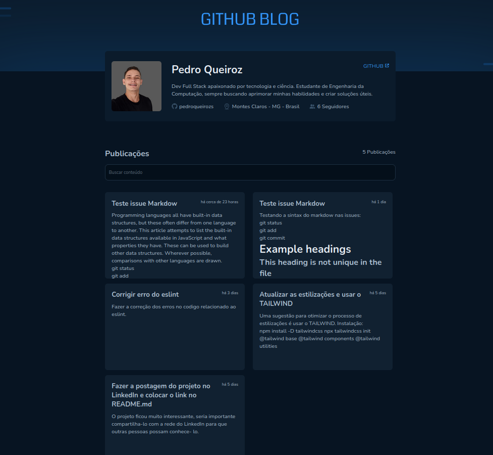

<h1 align="center">GitHub Blog</h1>

A aplicação consiste em um blog composto de Issues de um repositorio do GitHub.
 

  <a href="#-tecnologias">Tecnologias</a>&nbsp;&nbsp;&nbsp;|&nbsp;&nbsp;&nbsp;
  <a href="#-projeto">Projeto</a>&nbsp;&nbsp;&nbsp;|&nbsp;&nbsp;&nbsp;
  <a href="#-layout">Layout</a>&nbsp;&nbsp;&nbsp;|&nbsp;&nbsp;&nbsp;
  <a href="#memo-licença">Licença</a>

  

 

  

## 🚀 Tecnologias

Esse projeto foi desenvolvido com as seguintes tecnologias:

- React - Vite
- TypeScript
- Styled Components
- Axios
- React Router Dom
- API Git hub

## 💻 Projeto

O projeto foi desenvolvido com o intuito de praticar um pouco mais a tecnologia React com a API do Git Hub. O projeto faz a conecção com a api do github e trás dados de usuario e issues que formam o blog.-[Visite o projeto online]()

## 💻 Usage

## 🔖 Layout

Você pode visualizar o layout do projeto através [DESSE LINK](. É necessário ter conta no [Figma](https://figma.com) para acessá-lo.

## :memo: Licença

Esse projeto está sob a licença MIT.

---
